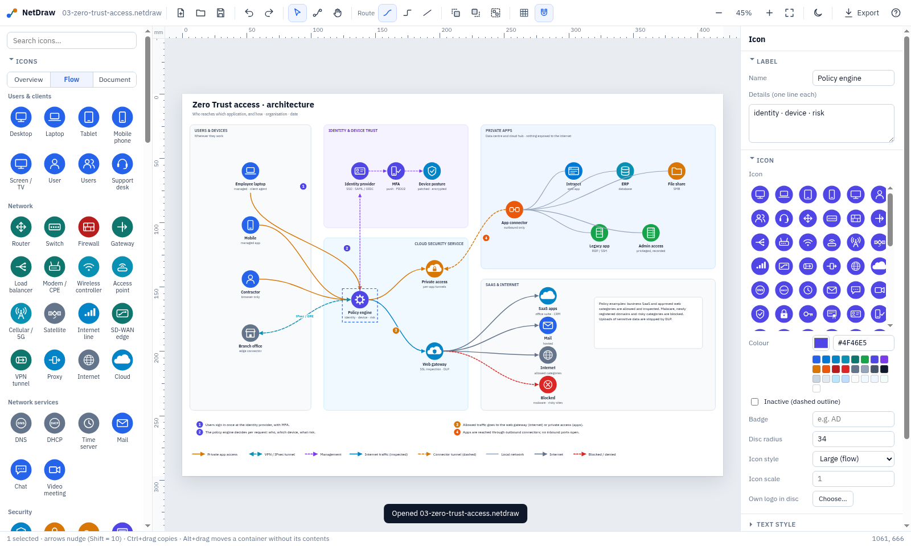

# NetDraw

A Windows desktop editor for network and architecture diagrams: coloured icon discs, light containers, flow lines
with arrowheads, numbered steps and a legend. You build a diagram by drag and drop, then export it as a PNG for
Word, a PDF for print or an SVG.

It is built for working live, in a meeting: fast to draw, consistent in style, and readable on screen and on A3.



## Install (Windows)

1. Download `NetDraw-<version>-win-x64.zip` (or the installer) from **Releases**.
2. Unzip it to a folder of your own, e.g. `%LOCALAPPDATA%\Programs\NetDraw`, and start `NetDraw.exe`.
3. Optional: **Help → Set up on this PC**. This adds a Start-menu shortcut, and `.netdraw` files then open with a
   double-click. It needs no admin rights.

The builds are not code-signed, so SmartScreen may ask "Run anyway" the first time.

## What you can do

| | |
|---|---|
| **Icons** | 87 generic icons in 10 groups (users, network, security, SSE/SASE, servers, data, places, OT, symbols), in three sizes: *Overview*, *Flow*, *Document*. You can also put your own logo inside a disc. |
| **Containers** | Site, cloud service, cloud hub, data centre, DMZ, trusted zone, management, section band, note, text box, pill. Dragging a container moves everything inside it. |
| **Lines** | Drag from an icon's blue dot to another icon. Lines stay attached when icons move. Route them as curve, orthogonal or straight. There are 16 line styles with generic names, and you can save your own. A line can carry a label. |
| **Explaining** | Numbered markers, `?` / `!` markers, notes with wrapping text, and a legend built from the line styles you used. |
| **Layout** | Grid and snapping to other items, align / distribute, groups, lock, z-order, and rulers in millimetres. |
| **Paper** | A4–A0 portrait/landscape, slide 16:9, and a wide overview size. The print scale is 1 px = 0.2 mm, so you always know what fits on A3. |
| **Export** | PNG 2× for Word, PNG at 300 dpi for print, a vector PDF at paper size, and SVG with the fonts embedded. *Copy as image* (`Ctrl+Shift+C`) pastes straight into Word. |
| **Comfort** | Dark mode: the drawing is previewed dark, exports stay white. Autosave and crash recovery, templates, find (`Ctrl+F`), and an adjustable interface size. |

**Help → Keyboard and mouse** has the full list of shortcuts.

## Command line

```
NetDraw.exe drawing.netdraw                                     open a file
NetDraw.exe --export drawing.netdraw --out drawing.png --scale 2
NetDraw.exe --export drawing.netdraw --out drawing.pdf          vector, at paper size
NetDraw.exe --export drawing.netdraw --out drawing.svg
NetDraw.exe --setup                                             Start-menu shortcut + .netdraw association
```

On Linux (headless): `tools/nd-export.sh drawing.netdraw drawing.png 2`.

## Drawings from scripts

`python/netdraw.py` writes `.netdraw` projects in the same house style, so generated drawings stay editable:

```python
import sys; sys.path.insert(0, 'python')
from netdraw import Doc, PALETTE as C
d = Doc(paper_size='A3', title='Example', style='overview')
a = d.node('pc', 300, 400, C['client'], 'Client', 'PC or server')
b = d.node('server', 700, 400, C['dc'], 'Local DC', badge='AD')
d.connect(a, b, 'zia', label='HTTPS')      # routed, labelled, bound to both icons
d.legend(40, 1400)
d.save('example.netdraw')
```

See `python/example.py` and `python/templates.py`. Flow keys, icon keys and style rules are listed in the Claude Code
skill that ships with the project setup (`netdraw`).

## File format

`.netdraw` is JSON. It holds a `page` object (size, background, font, grid, print scale) and an ordered `items` list,
from back to front. The item types are:

- `node`: icon disc + label
- `zone`: container, optionally with wrapping `body` text
- `connector`: SVG path, optional `from`/`to` binding to icons, optional `label`
- `text`: optional `wrap` width
- `badge`
- `path`
- `circle`
- `image`

Coordinates are page pixels, and text `y` is the baseline.

## Development

```
npm install
npm start                      run the editor (Linux: unset ELECTRON_RUN_AS_NODE first)
npm test                       unit tests (path maths, model, renderer, Python/app parity)
xvfb-run -a node tools/ui-test.mjs <file> /tmp     end-to-end UI tests (also ui-test2, ui-test3)
node tools/verify.mjs a.netdraw original.png        pixel-compare a project with a reference image
node tools/glyph-sheet.mjs icons.png               contact sheet of every icon
npx electron-builder --win --x64                    Windows zip + portable exe (works on Linux, no Wine)
```

The GitHub Actions workflow builds the Windows installer, zip and portable exe on every `v*` tag and attaches them
to a release.

### Code map

- `app/`: Electron main process and preload. Handles file dialogs, PNG/PDF rendering, the command line and autosave.
- `src/js/render.js` + `glyphs.js`: document → SVG. **Keep this output stable**: the reference drawings are
  verified pixel-exact against it.
- `src/js/editor.js`: the canvas, selection, guides, connectors and rulers.
- `src/js/props.js`: the panel on the right.
- `src/js/palette.js`: the panel on the left.
- `src/js/presets.js`: the house style (palette, icon styles, containers, line styles, paper sizes).
- `src/js/path.js`: path maths and routing.
- `src/js/model.js`: document operations.
- `src/js/textmetrics.js` + `metrics.js`: font metrics for wrapping and legends.

## Licence

Private project. The IBM Plex Sans fonts in `src/fonts/` are © IBM Corp. and licensed under the SIL Open Font
License 1.1 (`src/fonts/OFL.txt`).
